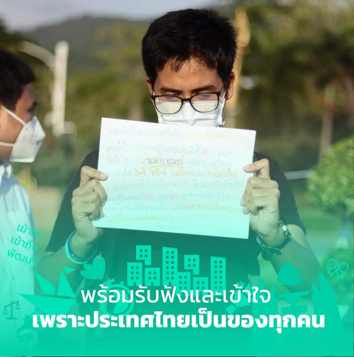
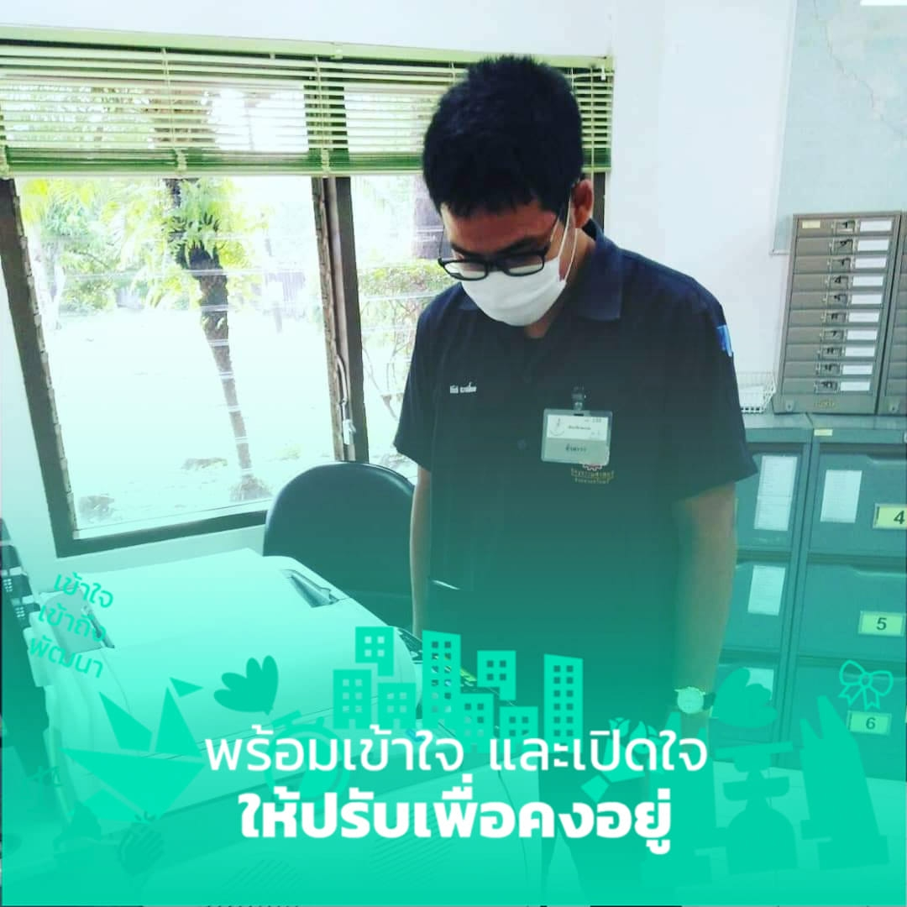

ผมเองมันคนหัวเก่าเนอะ ถึงผมจะไม่ชอบการเข้ามาของรัฐบาล แต่ผมเองก็รู้สึกว่าทำไมผมไม่สามารถเป็นปีศาจได้ ทำไมผมไม่ได้เป็นคนที่เดินมาตามกาลเวลาเหมือนคนอื่น ๆ ได้ ทำไมใจเรากลับรู้สึกกระสับกระส่าย เหมือนกับเจ้าสัวในเรื่องปีศาจ ที่กำลังดิ้นจะทำยังไงก็ได้ให้อยู่รอด จากปีศาจแห่งกาลเวลา ที่มาทวงคืนความยุติธรรม ทำไมผมต้องดิ้น ผมถามตัวเอง ผมทำผิดอะไรไว้ หรือผมกำลังเป็นสิ่ง ๆ หนึ่งที่เพื่อนในประเทศกำลังไม่ชอบเราหรือเปล่า

## ทำไมเราไม่ใช่ปีศาจ

แต่ที่รู้ ๆ ผมเองรู้สึกว่าผมเองอยู่บนพีระมิดของความเหลื่อมล้ำ ผมอาจเป็นคน 10% ท่ามกลางคน 90% ที่กำลังจะถูกผลักลงจากยอดของพีระมิดที่ไม่ชอบธรรมนี้ แล้วผมดิ้นทำไม ผมถามตัวเองอีกครั้ง ทำไมผมถึงลงไปอยู่ข้างล่าง แล้วร่วมกันผลักคนที่อยู่ด้านบนด้วย แต่ไม่ว่าอย่างไรก็ตาม สิ่งเหล่านี้เองทำให้ผมเองเป็นคนที่อนุรักษ์นิยม ผมพยายามปรับนะ ผมพยายามกระโดดลงไป แต่ผมใจไม่แข็งพอ หรือ ผมไม่กล้าพอ (และตอนนี้ก็คิดว่าไม่จำเป็นต้องแข็ง) ใจผมนุ่มนิ่ม และอ่อนไหวมาก ผมยังต้องหาสิ่งยึดเหนี่ยวจิตใจอยู่ตลอด

## เราเป็นผู้ที่อยู่บนพีระมิดของความเหลื่อมล้ำ ??

แต่ด้วยความรู้สึกที่ว่าเรากำลัง กำลัง เหยียบเขาอยู่หรือเปล่า และรู้มาตลอดว่าสิ่งที่เราเหยียบอยู่ตอนนี้มันเปราะมาก ผมจึงมีความคิดว่าผมต้องลงอ่ะ หรือ ทำยังไงก็ได้ให้ข้างล่างแข็ง หรือ ทัดเทียม เพียงพอกับเรา เพื่อเราจะได้อยู่ได้อย่างมั่นคง ถ้าใครลองจินตนาการตาม และลองเปรียบเทียบมันก็คงไม่แปลกที่ผมกำลังเป็นเจ้าสั่วที่ตัวสั่นยิ๊กๆ บนยอดเขา และนั่นทำให้ผมเป็นอนุรักษ์นิยมที่อ่อนมาก อ่อนมาก ๆ ไม่ต้องสงสัยว่าคนรุ่นนี้ยังมีคน Conservative อีกเหรอ แกล้งรึเปล่า ไม่อ่ะ

หลายคนบอกให้ผมเลิกตามการเมืองนะ เพราะใจผมอ่อนมากในเรื่องการเมือง ถึงจะเข้มแข็งขึ้นเยอะละ แต่ผมก็ยังเลิกตามไม่ได้ มันมาหาตลอด 555
ผมเองก็สนับสนุนม็อบ และก็ว่าจะหาผ้าสีขาวมาติดเหมือนกัน แต่พอเห็นเด็ก ๆ ผูกผ้าสีขาว ผมเองก็กลัว เออ แปลกมั้ยหละ ผมก็คิดเหมือนหลาย ๆ อย่าง ผมอยากให้มีการเปลี่ยนแปลงเพื่อสังคมที่ดีกว่า แต่พอผมเห็นคนมาม็อบ แล้วม็อบสวยมาก ๆ ผมเองก็นั่งดูนั่งฟังนั่งยิ้ม นั่งหัวเราะ แต่ลึกๆ ข้างใน ผมหวิว เออ แปลกมั้ยหละ หรือผมจะเป็นสลิ่ม อย่างที่เขาว่ารึเปล่า

## ถ้าเขาบอกว่าตอนนี้ฝ่ายขวากลัว แต่เรากลัวอะไร

ที่ผมหวิวเพราะว่า ผมกลัว กลัวฝ่ายอนุรักษ์หลายๆ คนไปทำอะไรให้เขาโกรธ ผมคิดอยู่เสมอว่า เห้ยอย่าไปทำอะไรเขานะ อย่าไปจับเขานะ อย่าไปต่อต้านเขานะ อย่าห้ามเขาแสดงออก อย่าห้ามเขาชูสามนิ้ว ให้เขาได้แสดงออก ให้เขาได้ปลดปล่อย เดี๋ยวจะรุนแรง เราต้องสนับสนุนเขา เราต้องภูมิใจในตัวเขาสิ เหมือนผมกลัวอ่ะ ผมกลัวอะไรว่ะ (ดังนั้นไม่ต้องถามเลยว่าทำไมคนที่ขวาจัดถึงรู้สึก)
ในความคิดของผมคือผมต้องถอยให้ถึงที่สุดเท่าที่ผมจะถอยได้ เราต้องปรับ ไม่ว่าจะวิธีทางใดก็ได้ เพื่อให้ยังเก็บไว้ซึ่งคุณค่าบางอย่างเอาไว้

โชคดีที่ผมกลัว และผมอ่อน ผมไม่ดื้อ ผมคิดว่าตอนนี้ Conservatives ควรถอย ควรอ่อน เพราะเราเอาพื้นที่ของเขามามากพอแล้ว และผมเปิดใจรับฟัง และ อาจจะเห็นด้วยบ้างไม่เห็นด้วยบ้าง แต่ถ้ามองด้วยใจเป็นกลาง จะพบว่าขอเสนอเหล่านี้ควรได้รับการตอบสนองในทางที่ดีด้วย เพื่อเป็นพื้นที่ให้กับเขา ไม่ว่าจะเพราะต้องการเพิ่มเติมจิตใจของเราให้พ้นจากความหวาดเสียว หรือ เพราะอะไรก็ตาม
แต่อย่างน้อยที่สุด ไม่ว่ามันจะออกมาเพื่อใคร อาจจะคิดว่าเราทำเพื่อตัวเองรึเปล่า หรืออย่างไรก็ตาม ผลที่มันก่อในสังคม มันก็เป็นผลดี และมีประโยชน์ร่วมกัน แสวงจุดร่วมสงวนจุดต่างได้ และถามว่าผมต้องเจ็บต่อไปมั้ย ผมคุยกับตัวเองแล้วว่า ต้องเจ็บสิ แล้วก็จะต้องทนด้วย นี่เป็นหลักการสำคัญที่สุดของประชาธิปไตยและการอยู่ร่วมกัน มันจำเป็นแชร์ทุกข์และสุขร่วมกัน ในเวลาที่ผ่านมา เราผลักความทุกข์ไว้กับพวกเขา และเราเลือกเก็บแต่ความสุขไว้ ทำให้เขามีความรู้สึกเป็นเจ้าของประเทศได้ไม่เต็มที่เช่นกันกับเรา แล้วมันก็จะเป็นแบบนี้แหละ ส่วนเพื่อน ๆ ของเรา เขาก็ไม่ได้หายเจ็บไปเลยอยู่แล้ว เขาก็ยังคงแบกอีกครึ่งหนึ่งเหมือนกัน

> ณ ตอนนั้นคงอาจจะต้องเลือกรับข่าว เรื่องไหนไม่สบายใจก็อาจจะต้องปิด ๆ บ้าง เป็นการส่วนตัว ตอนนั้นการ ignorance คงไม่โดนว่าแล้วเนอะ ตอนนี้คุณอาจจะว่าก็ได้แหละ ดำราะว่าสังคมมันยังไม่ได้แชร์ความรู้สึกกันอย่างดต็มที่ แต่เมื่อมัน Freedom of speech แล้วเนี่ย มันก็คงต้องมาคู่กับ Political Correctiveness ที่อาจจะต้องไม่สนใจบางเรื่อง เมื่อสนทนา 2 ต่อ 2 เพื่อให้สองคนนั้นไม่ตบกัน 5555 และให้เราอยู่ในสังคมเดียวกันได้

## ชีวิตมันก็อย่างนี้แหละเนอะ เราควรดีใจที่สังคมของเรา กำลังจะกลายเป็นสังคมก้าวหน้าเต็มตัว

โพสต์นี้คงทำให้หลายๆ คนเข้าใจความคิดของคนหัวอนุรักษ์แบบผมนะครับ บางทีที่เขาเรียกร้องให้มีพรรคตัวแทนจากฝั่งขวา ที่นิยม ปชต.บ้าง ก็เพราะแย่างนี้แหละครับ หลายคนใจไม่ได้กล้าพอที่จะเลือกไง ต้องเข้าใจจริง ๆ ว่าความพร้อมของคน มันไม่เท่ากันจริง ๆ ที่บางคนขอ Ignorance ก็เพราะบางทีใจเราไม่ได้เข้มแข็งเหมือนกันหมด เหมือนกับการบริจาคเงินนั่นแหละครับ ถามว่าดีมั้ยดี แต่ไม่ใช่ทุกคนจะบริจาค
สุดท้าย ผมเชื่อว่ามีคนแบบนี้อีกเยอะเลยในสังคม ที่อาจเห็นด้วย เห็นด้วยบ้างไม่เห็นด้วยบ้าง หรือ ไม่เห็นด้วยเลย แต่พร้อมเปิดใจรีบฟัง ผมเองในนามของ The Duck Creator ได้สร้างกรอบรูปชุดนี้ขึ้นมาครับ มี 3 รูป เผื่อท่านเองก็คิดเหมือนผม ถึงแม้เราไม่ได้อยากจะไปร่วม แต่เราพร้อมจะเข้าใจ พร้อมจะฟัง ผมเชื่อว่ามันจะเป็นภาพที่ดีต่อสังคมไทย
